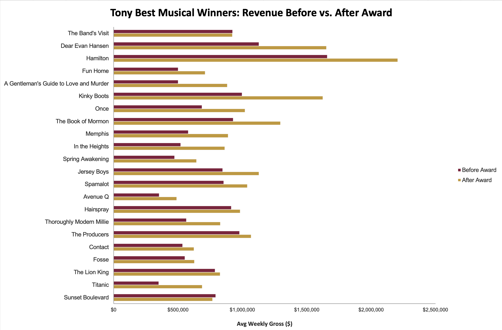
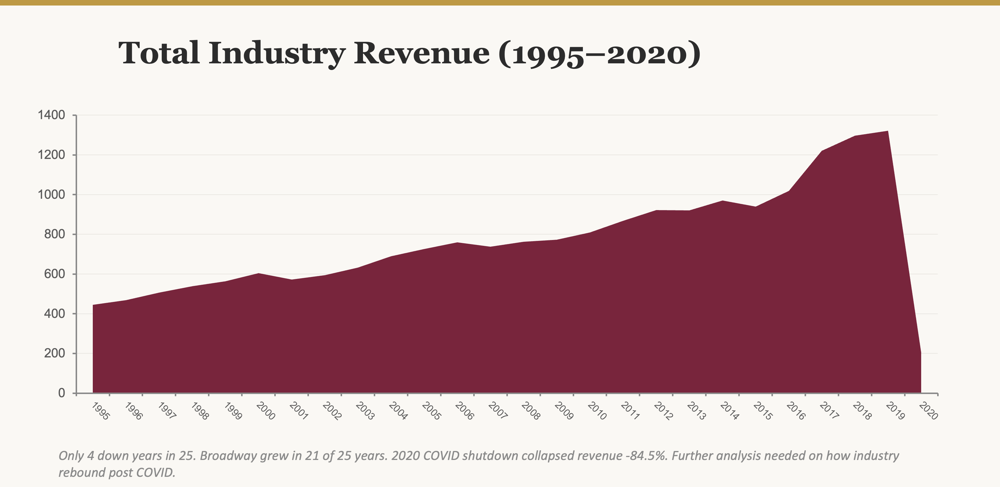
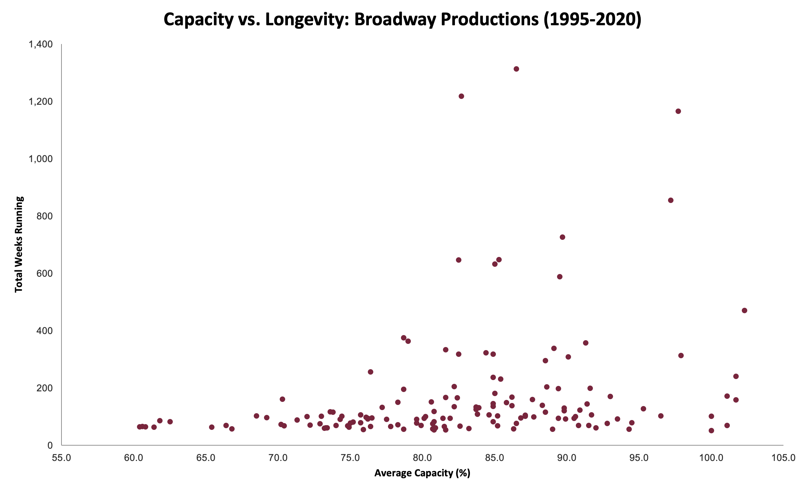

# Broadway Market Intelligence: A Data-Driven Framework for Industry Strategy (1995–2020)

**PostgreSQL-based strategic analysis of 145 Broadway productions and 47,500+ weekly performance records to identify the financial and operational drivers of commercial success in live entertainment.**

[](broadway_queries.sql)
[](insights.md)
[](deliverables/broadway_presentation.pdf)

---

## Project Background

The Broadway League is the national trade association for the Broadway industry, representing producers, theater owners, and presenters. As a strategic analyst, I needed to provide data-driven insights to help industry stakeholders make informed decisions about production development, marketing investment, and long-term sustainability planning.

This analysis combined weekly box office data (47,500+ records), manually researched show metadata (145 productions classified by type and category), and Tony Awards records to evaluate award impact, production type risk-return profiles, launch timing effects, and capacity utilization as a predictor of longevity.

## Data Structure

Three tables were designed in a normalized relational schema in PostgreSQL: shows (145 productions with type, category, and dates), financials (47,524 weekly performance records including gross revenue, capacity, and ticket prices), and tony_awards (33 Best Musical and Best Play winners with nomination and win counts).

**Primary dataset:** Alex Cookson / TidyTuesday Broadway Weekly Grosses (47,524 records, 1985–2020)

**Manually researched data:**
- **Show metadata:** 145 shows classified by type (Musical/Play) and category (Original Musical, Adaptation – Film, Adaptation – Book, Jukebox Musical, Revival, Original Play) using IBDB.com and Wikipedia
- **Tony Awards:** Best Musical and Best Play winners (1995–2020) from TonyAwards.com
- **Before/after analysis:** 22 Best Musical winners with pre- and post-ceremony revenue comparison

## Executive Summary

Broadway's commercial success is driven by sustained audience demand rather than peak revenue moments. Shows maintaining 82%+ capacity are the strongest candidates for long-running viability, Tony Award recognition is associated with a statistically significant 38% average revenue lift, and fall launches outperform all other seasons by nearly 2x in total gross. The industry quadrupled revenue from $445M to $1.82B over 25 years while tripling ticket prices — without suppressing demand.

### Top Findings

**1. Tony Award winners experience a 38% average increase in weekly gross in the 26 weeks following the ceremony.**
Across 22 Best Musical winners, a paired t-test confirmed this result is statistically significant (p < 0.001). Shows with lower pre-award revenue see the largest lifts (Titanic nearly doubled at +96%), while shows already at capacity see minimal change. This quantifies the marketing ROI of award campaign investment.

**2. Fall launches generate nearly 2x the revenue of spring openings.**
Shows opening September–November average $218M in total gross and run 269 weeks, compared to $116M and 169 weeks for spring openings. Fall timing builds audience momentum through the holiday season and positions shows for Tony eligibility the following June.

**3. Sustained capacity above 82% is the strongest predictor of long-term commercial viability.**
All 9 shows that ran 10+ years maintained average capacity above this threshold. Shows like The Lion King and Wicked sustain 97%+ capacity over decades. Consistent demand — not peak gross — predicts longevity.

**4. Ticket prices tripled from $42 to $125 without suppressing demand.**
Capacity actually increased alongside rising prices (81.7% → 90.2%), demonstrating Broadway's exceptional pricing power. The industry grew in 21 out of 25 years, with only post-9/11 (2001) and COVID (2020) producing significant declines.

**5. Original works win Tonys at 3–10x the rate of revivals and jukebox musicals, creating a strategic risk-return tradeoff.**
Original Musicals and Original Plays win at 38% and 55% respectively, versus 5–6% for Revivals and Jukebox Musicals. Adaptations carry lower risk through built-in audience awareness but rarely achieve critical recognition.

## Insights Deep Dive

### Tony Awards Marketing ROI

The showpiece analysis of this project: a structured before-and-after comparison of average weekly gross in the 26 weeks before versus after the Tony ceremony for each Best Musical winner. The 38% average lift was validated with both parametric (paired t-test, p < 0.001) and non-parametric (Wilcoxon signed-rank, p < 0.001) testing. The 95% confidence interval for the mean weekly increase is $162,946 to $323,638.

**Important caveat:** The post-award window coincides with summer tourism season, which naturally drives higher industry revenue. Future analysis could include a control group of nominated-but-not-winning shows to better isolate the award effect.

```sql
-- Tony Awards ROI: Before/After revenue comparison
-- Skills: CTEs, CASE, MAKE_DATE, INTERVAL, NULLIF, HAVING
WITH tony_dates AS (
    SELECT 
        t.show,
        t.year,
        MAKE_DATE(t.year, 6, 15) AS tony_ceremony_date
    FROM tony_awards t
    WHERE t.result = 'Won' AND t.category = 'Best Musical'
)
SELECT 
    td.show,
    td.year AS tony_year,
    ROUND(AVG(CASE 
        WHEN f.week_ending < td.tony_ceremony_date THEN f.weekly_gross 
    END)::numeric, 0) AS avg_weekly_before,
    ROUND(AVG(CASE 
        WHEN f.week_ending >= td.tony_ceremony_date 
             AND f.week_ending < td.tony_ceremony_date + INTERVAL '26 weeks'
        THEN f.weekly_gross 
    END)::numeric, 0) AS avg_weekly_after,
    ROUND(
        (AVG(CASE WHEN f.week_ending >= td.tony_ceremony_date 
                       AND f.week_ending < td.tony_ceremony_date + INTERVAL '26 weeks' 
                  THEN f.weekly_gross END) -
         AVG(CASE WHEN f.week_ending < td.tony_ceremony_date 
                  THEN f.weekly_gross END)) * 100.0 /
        NULLIF(AVG(CASE WHEN f.week_ending < td.tony_ceremony_date 
                        THEN f.weekly_gross END), 0),
        1
    )::numeric AS pct_change
FROM tony_dates td
JOIN financials f ON td.show = f.show
GROUP BY td.show, td.year, td.tony_ceremony_date
HAVING COUNT(CASE WHEN f.week_ending < td.tony_ceremony_date THEN 1 END) >= 10
   AND COUNT(CASE WHEN f.week_ending >= td.tony_ceremony_date THEN 1 END) >= 10
ORDER BY pct_change DESC;
```



### Market Health: A 25-Year Growth Story

Industry revenue quadrupled from $445M (1995) to $1.82B (2018 peak), with the largest single-year jump of +19.8% in 2017 driven largely by the Hamilton phenomenon. Ticket prices tripled without suppressing demand — capacity actually increased from 81.7% to 90.2%. The industry grew in 21 of 25 years, with only post-9/11 (2001) and COVID (2020) producing significant declines.



```sql
-- Year-over-year industry revenue growth using LAG
-- Skills: CTEs, LAG window function, NULLIF
WITH yearly_totals AS (
    SELECT 
        EXTRACT(YEAR FROM week_ending)::INT AS year,
        ROUND(SUM(weekly_gross)::numeric / 1000000, 2) AS total_gross_millions
    FROM financials
    WHERE week_ending >= '1995-01-01' AND week_ending < '2020-03-15'
    GROUP BY EXTRACT(YEAR FROM week_ending)
)
SELECT 
    year,
    total_gross_millions,
    LAG(total_gross_millions) OVER (ORDER BY year) AS prev_year_gross,
    ROUND(
        (total_gross_millions - LAG(total_gross_millions) OVER (ORDER BY year)) * 100.0 /
        LAG(total_gross_millions) OVER (ORDER BY year), 1
    ) AS yoy_pct_change
FROM yearly_totals
ORDER BY year;
```

### Competitive Rankings by Year

ROW_NUMBER with PARTITION BY identifies the top 3 grossing shows in each year, revealing how market dominance shifted over 25 years — from Phantom and Les Mis in the late 1990s to Wicked and Hamilton in the 2010s.

```sql
-- Top 3 grossing shows per year using ROW_NUMBER
-- Skills: CTEs, ROW_NUMBER, PARTITION BY
WITH yearly_gross AS (
    SELECT 
        show,
        EXTRACT(YEAR FROM week_ending)::INT AS year,
        SUM(weekly_gross) AS total_gross
    FROM financials
    WHERE week_ending >= '1995-01-01' AND week_ending < '2020-03-15'
    GROUP BY show, EXTRACT(YEAR FROM week_ending)
),
ranked AS (
    SELECT 
        show,
        year,
        ROUND(total_gross::numeric / 1000000, 2) AS gross_millions,
        ROW_NUMBER() OVER (PARTITION BY year ORDER BY total_gross DESC) AS rank
    FROM yearly_gross
)
SELECT * FROM ranked
WHERE rank <= 3
ORDER BY year, rank;
```

### Capacity as a Longevity Predictor

All 9 shows that ran 10+ years maintained average capacity above 82%. The scatterplot of all 145 productions reveals a clear threshold — sustained demand, not peak revenue, predicts long-term viability.



### Launch Timing Strategy

CASE statements with EXTRACT classify 145 shows by opening season, revealing fall's significant advantage. Despite spring being the most popular opening window (74 shows), fall openings (40 shows) earn nearly double the average gross.

```sql
-- Opening season analysis
-- Skills: CASE, EXTRACT, date casting, subquery JOIN
SELECT 
    CASE 
        WHEN EXTRACT(MONTH FROM s.opening_date::date) IN (9, 10, 11) THEN 'Fall (Sep-Nov)'
        WHEN EXTRACT(MONTH FROM s.opening_date::date) IN (12, 1, 2) THEN 'Winter (Dec-Feb)'
        WHEN EXTRACT(MONTH FROM s.opening_date::date) IN (3, 4, 5) THEN 'Spring (Mar-May)'
        ELSE 'Summer (Jun-Aug)'
    END AS opening_season,
    COUNT(*) AS num_shows,
    ROUND(AVG(f.total_gross)::numeric / 1000000, 2) AS avg_gross_millions,
    ROUND(AVG(f.weeks)::numeric, 0) AS avg_weeks_running
FROM shows s
JOIN (
    SELECT show, SUM(weekly_gross) AS total_gross, COUNT(*) AS weeks
    FROM financials
    GROUP BY show
) f ON s.show = f.show
GROUP BY opening_season
ORDER BY avg_gross_millions DESC;
```

### Tony Winners vs. Non-Winners

A LEFT JOIN comparison shows Tony winners earn 75% more in total gross ($200M vs. $114M), run 37% longer (217 vs. 158 weeks), and maintain higher average capacity (85.7% vs. 80.9%).

```sql
-- Tony winners vs. non-winners aggregate comparison
-- Skills: CASE, LEFT JOIN, subquery, aggregation
SELECT 
    CASE WHEN t.show IS NOT NULL THEN 'Tony Winner' ELSE 'No Tony Win' END AS tony_status,
    COUNT(DISTINCT s.show) AS num_shows,
    ROUND(AVG(f.total_gross)::numeric / 1000000, 2) AS avg_gross_millions,
    ROUND(AVG(f.avg_cap * 100)::numeric, 1) AS avg_capacity_pct,
    ROUND(AVG(f.weeks)::numeric, 0) AS avg_weeks_running
FROM shows s
JOIN (
    SELECT show, SUM(weekly_gross) AS total_gross, AVG(pct_capacity) AS avg_cap, COUNT(*) AS weeks
    FROM financials
    WHERE week_ending >= '1995-01-01'
    GROUP BY show
) f ON s.show = f.show
LEFT JOIN tony_awards t ON s.show = t.show
GROUP BY CASE WHEN t.show IS NOT NULL THEN 'Tony Winner' ELSE 'No Tony Win' END;
```

## Recommendations

**Invest in Tony Award Campaigns**
The 38% post-award revenue lift, validated at p < 0.001, provides quantitative justification for award campaign spending. Shows with moderate pre-award revenue stand to gain the most from a win.

**Prioritize Fall Openings**
Fall launches earn nearly 2x spring openings and position shows for Tony eligibility with a full season of audience-building behind them. Producers should time openings to September–November when possible.

**Monitor Capacity as a Leading Indicator**
Sustained capacity above 82% is the clearest signal of long-term viability. Theater owners should use capacity trends — not just gross revenue — to inform extension and closing decisions.

**Balance Portfolio Risk with Originals**
Original works carry higher risk but offer 3–10x the Tony win rate and the potential to create new cultural IP. A balanced production pipeline should include originals alongside lower-risk adaptations and revivals.

## Tools & Skills

| Tool | Use |
|------|-----|
| PostgreSQL | Database design, complex queries, all analysis |
| pgAdmin 4 | Query execution and result export |
| Excel | Data visualization and deliverable creation |
| Python (SciPy) | Statistical validation (t-test, Wilcoxon signed-rank) |

**SQL techniques demonstrated:** CTEs (Common Table Expressions) · Window functions (LAG, ROW_NUMBER, PARTITION BY, ROWS BETWEEN) · Multi-table JOINs with subqueries · CASE statements for categorization and before/after analysis · Date arithmetic (MAKE_DATE, INTERVAL, EXTRACT) · NULLIF/COALESCE for NULL handling · GROUP BY with HAVING for statistical filtering · Aggregate functions across multiple dimensions

## Deliverables

| Document | Description |
|----------|-------------|
| [SQL Queries](broadway_queries.sql) | 18 analytical queries across 6 query sets with detailed comments |
| [Insights Report](insights.md) | Full strategic findings report with methodology, caveats, and recommendations |
| [Project Data Workbook](data/broadway_project_data.xlsx) | Combined dataset with show metadata, Tony Awards, before/after analysis, and statistical validation |
| [Source Dataset](data/grosses_clean.csv) | Alex Cookson / TidyTuesday Broadway Weekly Grosses (47,524 records) |
| [Presentation](deliverables/broadway_presentation.pdf) | Executive presentation of key findings |

## Author

**Jessica Duong**

Data Analyst | [LinkedIn](https://www.linkedin.com/in/jess-duong/) | [Portfolio](https://jess-duong.github.io/) | duong.t.jess@gmail.com

---

*Primary data source: Alex Cookson / TidyTuesday Broadway Weekly Grosses Dataset (47,524 records, 1985–2020). Show metadata (145 productions) manually researched and classified using IBDB.com and Wikipedia. Tony Awards data manually collected from TonyAwards.com.*

## Acknowledgments

AI tools (Claude, Anthropic) were used to assist with identifying the primary dataset, structuring SQL queries, statistical validation, and documentation. All supplementary data, including show classification, Tony Awards records, and before/after revenue analysis, was manually researched and entered by the analyst. All queries were executed and validated in PostgreSQL/pgAdmin.
